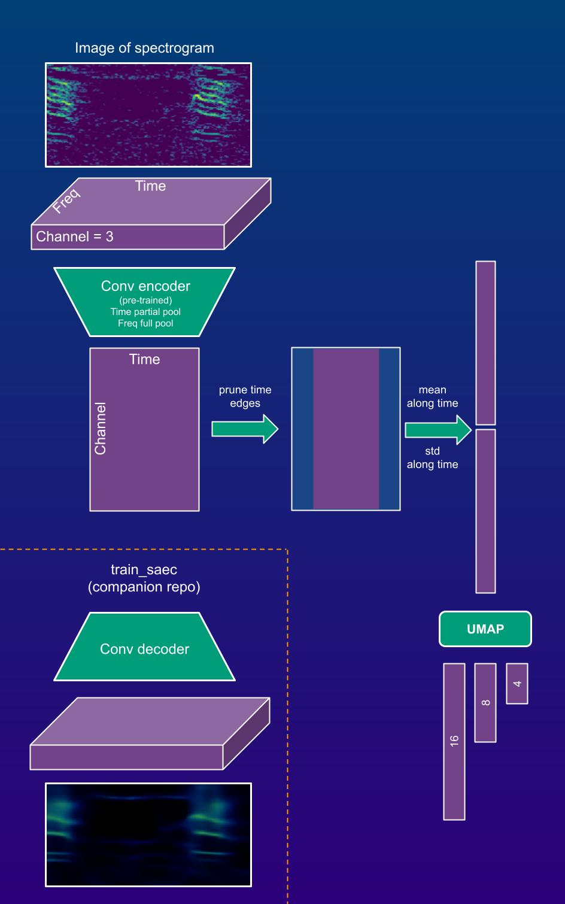

# Feature extraction with pre-trained spectrogram auto-encoders (fe_saec)

### Overview
* This is a python package to extract encoder-based features from spectrograms 
* Extract array features with these auto-encoders and convert them to linear features (details in pic below)
* Encoders perform partial pooling of time axis (latent array representation is 2D -> channel by time)
* Extracted features are meant to be used in companion [project](https://github.com/sergezaugg/spectrogram_image_clustering) and its [frontend](https://spectrogram-image-clustering.streamlit.app/)


### Intallation (usage in Python project)
* Make a fresh venv an install **fe_saec** from Python package wheel found on [this github repo](https://github.com/sergezaugg/feature_extraction_saec/releases)
* ```pip install https://github.com/sergezaugg/feature_extraction_saec/releases/download/vx.x.x/fe_saec-x.x.x-py3-none-any.whl```
* **torch** and **torchvision** must be installed separately for specific CUDA version
* ```pip install torch torchvision --index-url https://download.pytorch.org/whl/cu126``` (e.g. for Windows with CUDA 12.6 and Python 3.12.8)
* If other CUDA version needed, check instructions here https://pytorch.org/get-started/locally

### Usage 
* Prepare PNG formatted color images of spectrograms, e.g. with [this tool](https://github.com/sergezaugg/xeno_canto_organizer)
* [sample_code.py](sample_code.py) illustrates a pipeline to extract features
* Array and dim-reduced features are written to disk as NPZ files in parent of images dir.

### ML details



